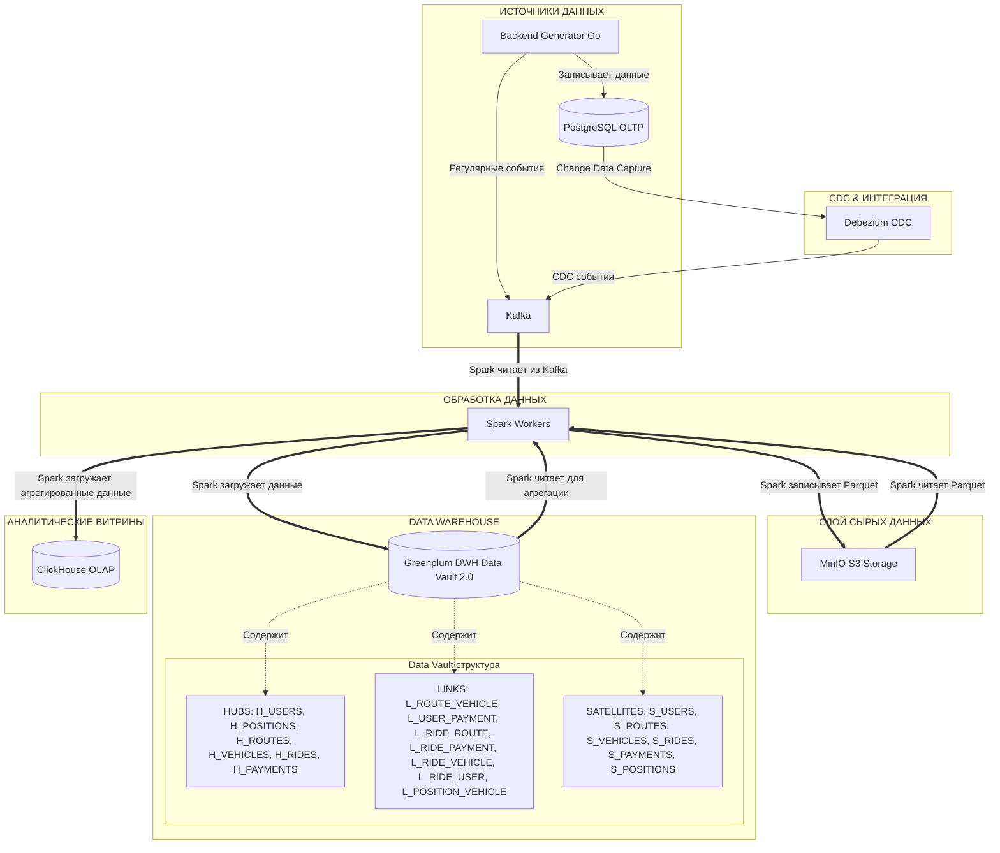
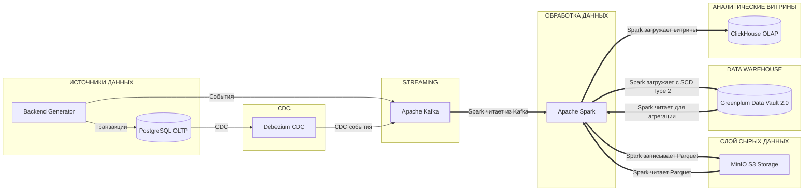
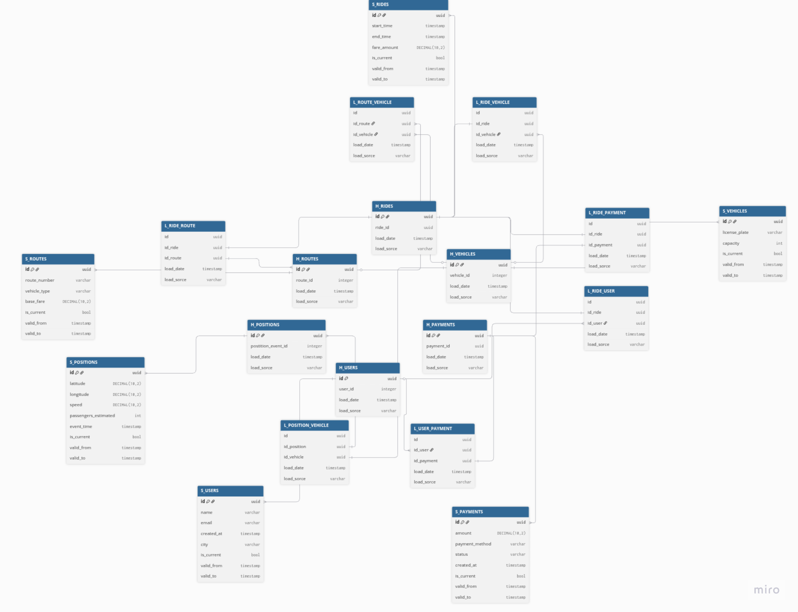
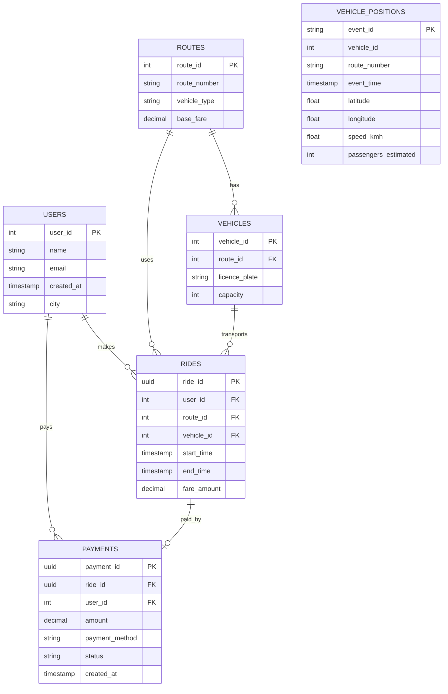
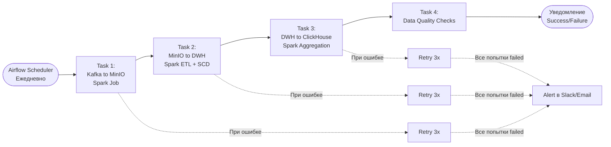

# MetroPulse

Аналитическая платформа для сервиса отслеживания общественного транспорта в реальном времени.

## Архитектура

### Общая схема системы

### Поток данных

### Data Vault 2.0 структура

## Источники данных

**PostgreSQL OLTP** - транзакционные данные (USERS, ROUTES, VEHICLES, RIDES, PAYMENTS)

**Kafka Topic: vehicle_positions** - потоковые события от транспорта (VEHICLE_POSITIONS)

## Обоснование выбора технологий

### PostgreSQL (OLTP)
- Гарантия целостности данных для транзакций
- Проверенное решение для OLTP-нагрузок

### Apache Kafka
- Высокая пропускная способность
- Репликация и устойчивость к сбоям
- Горизонтальное масштабирование
- Нативная поддержка Debezium и Spark

### Debezium CDC
- Все INSERT/UPDATE/DELETE сохраняются и могут быть использованы для аналитики

### MinIO
- Стандартный S3 API для работы с объектами
- Open source

### Apache Spark
- Eдиный движок для всех ETL операций
- Горизонтальное масштабирование
- Нативная поддержка Kafka, S3, PostgreSQL, Greenplum
- Встроенные возможности для отслеживания истории

### Greenplum (DWH)
- Параллельная обработка запросов
- Оптимизация для аналитических запросов
- Эффективная работа с большими объемами

### ClickHouse (OLAP)
- На порядки быстрее традиционных СУБД
- Оптимизация для агрегаций
- Эффективное использование дисков
- Горизонтальное масштабирование
- Поддержка всех популярных инструментов

### Data Vault 2.0
- Легко добавлять новые источники данных
- Полная история изменений (load_date, load_source)
- Подходит для больших и сложных систем

## Обоснование выбора методологии моделирования

### Kimball vs Data Vault 2.0

| Критерий | Kimball (Star Schema) | Data Vault 2.0 | Выбор |
|----------|----------------------|----------------|-------|
| **Гибкость** | Сложно добавлять источники | Легко добавлять источники | DV |
| **История изменений** | SCD Type 2 в измерениях | Встроенная в Satellites | DV |
| **Скорость разработки** | Быстрее для простых схем | Медленнее на старте | Kimball |
| **Производительность запросов** | Оптимизирована для BI | Требует витрин | Kimball |
| **Масштабируемость** | Ограничена | Высокая | DV |
| **Аудит данных** | Ограниченный | Полный (load_date, load_source) | DV |
| **Параллельная загрузка** | Зависимости между таблицами | Независимые Hubs/Links/Satellites | DV |

По итогу был выбран Data Vault 2.0, так как он подходит для больших и сложных систем, а также позволяет легко добавлять новые источники данных.

## Реализация SCD Type 2

Debezium используется для захвата изменений из PostgreSQL OLTP в реальном времени. Он читает Write-Ahead Log (WAL) PostgreSQL и публикует все операции INSERT/UPDATE/DELETE как события в Kafka топики (users_cdc, routes_cdc, vehicles_cdc, rides_cdc, payments_cdc). Это позволяет получать изменения без нагрузки на OLTP базу и обеспечивает полную историю всех модификаций данных для последующей обработки в Spark и загрузки в Data Vault с сохранением временных меток и источника изменений.

SCD Type 2 реализован в Satellites таблицах (S_USERS, S_ROUTES, S_VEHICLES) для отслеживания исторических изменений. При изменении атрибутов (например, стоимости маршрута) текущая запись закрывается (`is_current=false`, `valid_to=текущая_дата`), и создается новая версия с обновленными данными (`is_current=true`, `valid_from=текущая_дата`, `valid_to=NULL`). Это позволяет получать данные "на момент времени" и анализировать историю изменений, сохраняя полный аудит всех модификаций в системе.

## Оркестрация с Apache Airflow

В рамках данного проекта такая оркестрация не была реализована, но есть схема, показывающая как это можно было сделать:

**Структура:**
- **Task 1**: Чтение из Kafka → запись в MinIO (Parquet)
- **Task 2**: ETL из MinIO → Greenplum (Hubs → Links → Satellites с SCD Type 2)
- **Task 3**: Агрегация из Greenplum → ClickHouse (витрины)
- **Task 4**: Проверка качества данных (row counts, null checks)
